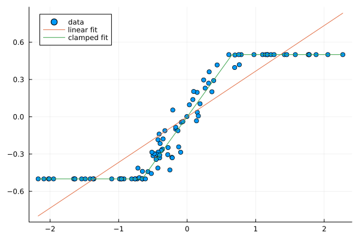

# ClampedRegression.jl

As the plot above illustrates, normal linear regression is often a poor fit for real-world data that has a known lower and upper bound. In such cases, a more effective approach is to use logistic regression, which fits a sigmoid form to the data that approaches (without ever reaching) the bounds. Logistic regression is computationally efficient.

This repository demonstrates a different and worse approach. Instead of fitting a smooth sigmoid, we fit a linear function that “clamps” to the (known) lower and upper bound values. This can be modeled with integer quadratic programming and indicator variables. The slight advantage over logistic regression is that we get zero prediction error on the “arms” of the plot, and we guarantee that our predicted values actually saturate the available range. The major downside is that this functional form is much more costly to estimate, because IP is hard.

You probably don’t want to use this. **You probably want to use logistic regression.**
